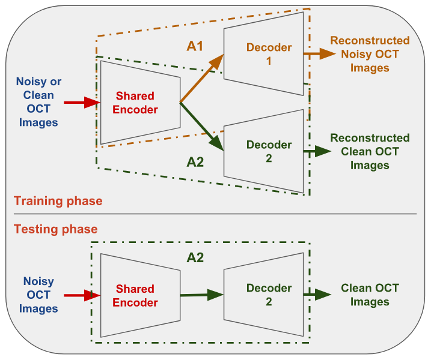

# <p align="center">  _Desenruido de Imágenes de Tomografía de Coherencia Óptica (OCT) basado en Codificador Compartido (SE)_
## <p align="center"> _ICVGIP 2018_ [[artículo]](https://www.google.com/url?sa=t&rct=j&q=&esrc=s&source=web&cd=9&ved=2ahUKEwiv2Ib77MTfAhXXdn0KHZsrCrkQFjAIegQIBBAC&url=http%3A%2F%2Fweb2py.iiit.ac.in%2Fresearch_centres%2Fpublications%2Fdownload%2Finproceedings.pdf.b2c08820db3e1d98.53756b6573685f49435647495031385f53452e706466.pdf&usg=AOvVaw27oqOvZQ2fAmV2JX9jtQd4)
Las imágenes OCT se ven afectadas por ruido speckle debido a la estrategia subyacente basada en coherencia. La supresión/eliminación de speckle en imágenes OCT juega un papel significativo tanto en la detección manual como automática de enfermedades, especialmente en el diagnóstico clínico temprano. En este trabajo, se propone un nuevo método para el desenruido de imágenes OCT basado en CNN que aprende características comunes a partir de imágenes OCT ruidosas y limpias no emparejadas de manera no supervisada y de extremo a extremo. El método propuesto consiste en una combinación de dos autoencoders con capas de codificador compartidas, a las que denominamos arquitectura de **Codificador Compartido (SE)**. El SE se entrena para reconstruir imágenes OCT ruidosas y limpias con sus respectivos autoencoders. La imagen OCT desenruidada se obtiene mediante una predicción cruzada entre modelos. El método propuesto puede utilizarse para el desenruido de imágenes OCT con o sin patología procedentes de cualquier escáner.

<p align="center"> Representación esquemática de la arquitectura propuesta de Codificador Compartido (SE)

<p align="center">  

### Dependencias
Este código depende de las siguientes bibliotecas:

- Keras >= 2.0
- keras_contrib >= 1.2.1
- Theano = 0.9.0

El código debería ser compatible con las versiones de Python 2.7-3.5. (probado en python2.7)

### Conjuntos de datos
Los conjuntos de datos se pueden encontrar en los siguientes enlaces:
1) [Dataset1](https://people.duke.edu/~sf59/Fang_TMI_2013.htm)
2) [Dataset2](https://people.duke.edu/~sf59/Fang_BOE_2012.htm)

Para más detalles, consulte la sección de experimentos en el [artículo](http://web2py.iiit.ac.in/research_centres/publications/download/inproceedings.pdf.b2c08820db3e1d98.53756b6573685f49435647495031385f53452e706466.pdf).

### Entrenamiento

El modelo puede entrenarse con el comando:  
```
python2.7 train_SE.py
```
Los datos deben colocarse en las siguientes rutas:
- ./data/noisy_data/
- ./data/clean_data/

### Prueba
Los pesos de los modelos SE y SSE1 se encuentran en la carpeta weights. SSE1 (el mejor) es una versión de ajuste fino (fine-tune) de SE. Más detalles están disponibles en el artículo.

El resultado puede reproducirse con el comando:
```
python2.7 test_SE.py
```
Por defecto está configurado en SSE1. Por favor, cambie 'modelName' en la sección de parámetros para alternar entre 'SE' y 'SSE1'.

Los resultados predichos se guardarán en "./test_images/"

### POR HACER
- Agregar algunos resultados
- Agregar opciones de línea de comandos para establecer parámetros
- Actualizar el código para el backend de tensorflow

### Citación
Si utiliza este código para su investigación, por favor cite:

```
@inproceedings{adiga2018se,
  title={Shared Encoder based Denoising of Optical Coherence Tomography Images},
  author={Adiga, Sukesh V and Sivaswamy, Jayanthi},
  booktitle={Proceedings of the 11th Indian Conference on Computer Vision, Graphics and Image Processing (ICVGIP)},
  year={2018},
  organization={ACM}
}
```

##### Licencia
Este proyecto está licenciado bajo los términos de la licencia MIT.
