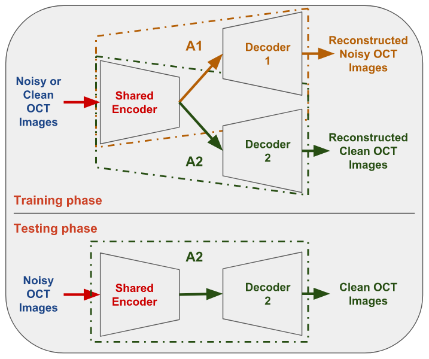

# Shared Encoder (SE) based Denoising of Optical Coherence Tomography (OCT) Images

OCT images are corrupted by speckle noise due to the underlying coherence-based strategy. Speckle suppression/removal in OCT images plays a significant role in both manual and automatic detection of diseases, especially in early clinical diagnosis. In this work, a new method is proposed for denoising OCT images based on CNN by learning common features from unpaired noisy and clean OCT images in an unsupervised, end-to-end manner. The proposed method consists of a combination of two autoencoders with shared encoder layers, which we call as **Shared Encoder (SE)** architecture. The SE is trained
to reconstruct noisy and clean OCT images with respective autoencoders. The denoised OCT image is obtained using a cross-model prediction. The proposed method can be used for denoising OCT images with or without pathology from any scanner.

Download Paper: [[SE based Denoising]](https://www.google.com/url?sa=t&rct=j&q=&esrc=s&source=web&cd=9&ved=2ahUKEwiv2Ib77MTfAhXXdn0KHZsrCrkQFjAIegQIBBAC&url=http%3A%2F%2Fweb2py.iiit.ac.in%2Fresearch_centres%2Fpublications%2Fdownload%2Finproceedings.pdf.b2c08820db3e1d98.53756b6573685f49435647495031385f53452e706466.pdf&usg=AOvVaw27oqOvZQ2fAmV2JX9jtQd4)

The Schematic representation of proposed Shared Encoder (SE) architecture



### Dependencies
This code depends on the following libraries:

- Keras >= 2.0
- keras_contrib >= 1.2.1
- Theano = 0.9.0

Code should be compatible with Python versions 2.7-3.5. (tested in python2.7)

### Datasets
Datasets can be found in following links:
1) [Dataset1](https://people.duke.edu/~sf59/Fang_TMI_2013.htm)
2) [Dataset2](https://people.duke.edu/~sf59/Fang_BOE_2012.htm)

For more details, please check out the experiments section in the [paper](http://web2py.iiit.ac.in/research_centres/publications/download/inproceedings.pdf.b2c08820db3e1d98.53756b6573685f49435647495031385f53452e706466.pdf).

### Training

The model can be trained to reproduced with command:  
```
python2.7 train_SE.py
```
The data should be placed in below path
- ./data/noisy_data/
- ./data/clean_data/

### Test
The weights of SE and SSE1 models are present in weights folder. SSE1 (best) is fine-tune version of SE. More details are present in paper.

The result can be reproduced with command:
```
python2.7 test_SE.py
```
By default it is set to SSE1, Please change 'modelName' in parameter section to switch between 'SE' and 'SSE1'.

The predicted results will be saved in "./test_images/"

### TODO
- Add some results
- Add command line options to set parameter
- Update code for tensorflow backend

### Citation
If you use this code for your research, please cite:

```
@inproceedings{adiga2018se,
  title={Shared Encoder based Denoising of Optical Coherence Tomography Images},
  author={Adiga, Sukesh V and Sivaswamy, Jayanthi},
  booktitle={Proceedings of the 11th Indian Conference on Computer Vision, Graphics and Image Processing (ICVGIP)},
  year={2018},
  organization={ACM}
}
```

##### License
This project is licensed under the terms of the MIT license.
